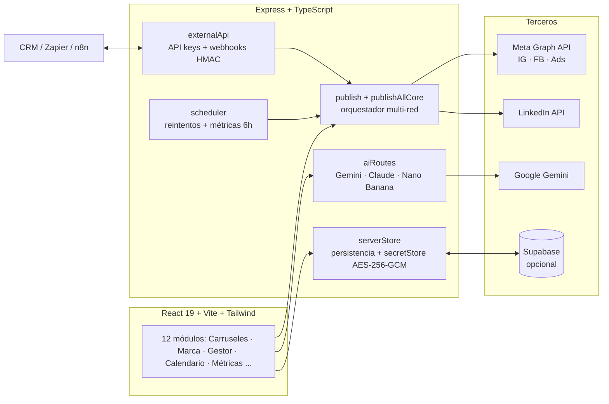

<div align="center">

# 🚀 AdTeam AI

### Suite full-stack de marketing autónomo con IA para creadores e infoproductores

Crea contenido real con IA (carruseles, imágenes de marca, copys, videos), publícalo o prográmalo en **Instagram, Facebook y LinkedIn con un solo click**, mide qué funcionó y deja que los datos guíen el próximo contenido.

[](https://github.com/octi35/SistemaDeMarketingCompleto/actions/workflows/ci.yml)


</div>

---

## ✨ Qué hace

| Capacidad | Detalle |
| --- | --- |
| 🎨 **Carruseles con IA** | La IA escribe los slides y **Nano Banana** (modelo de imágenes de Gemini) genera los fondos. Diseño 100% personalizable por slide: prompt exacto propio, tipografía, posición/alineación del texto, 4 colores, overlay, marca de agua. Plantillas de diseño reutilizables. |
| 🖼 **Fábrica de imágenes de marca** | Planifica y genera hasta **50 imágenes coherentes con tu Brand Kit** en lote (concurrencia limitada, reintentos, progreso en vivo), guardadas en una biblioteca lista para publicar. |
| 📤 **Publicación 1-click multi-red** | Un endpoint orquesta Instagram (post/carrusel/**Reel**), Facebook (foto/multi-foto/video) y LinkedIn en paralelo; cada red falla de forma independiente y reporta su resultado. |
| ⏰ **Programación real** | Scheduler en el servidor con tokens **cifrados AES-256-GCM**, reintentos con backoff y re-encolado manual. Calendario de 30 días generado por IA, con vista por red, creatividades adjuntas y export **.ics**. |
| 📊 **Métricas y decisiones** | Métricas reales de IG/FB (Graph API), histórico automático cada 6h, experimentos A/B, mejores horarios calculados de **tus** posts, e ideas/calendarios que la IA genera alimentada por tu engagement medido. |
| 🔗 **Integrable** | API externa con API keys (`/api/ext/*`) y **webhooks firmados** (HMAC-SHA256) para conectar CRMs, funnels o Zapier/Make/n8n. [Documentación de la API](./API.md). |
| ☁️ **Persistencia opcional en la nube** | Con dos variables de entorno, el estado se respalda en **Supabase** (Postgres + Storage) y sobrevive redeploys; sin ellas todo funciona local. |

## 🏗 Arquitectura



**Decisiones de diseño destacables:**
- El scheduler llama a las funciones de publicación **directamente** (sin HTTP a sí mismo) y resuelve los tokens cifrados just-in-time.
- La lógica de "publicar en todas" vive en un solo módulo (`publishAllCore`) compartido por la ruta interna, la API externa y el scheduler.
- La capa de persistencia está aislada en `serverStore.ts`: file-based por defecto, espejada a Postgres cuando Supabase está configurado (mismo API síncrono, push debounced en background).
- Todos los endpoints de escritura validan con **Zod**; los flujos OAuth usan `state` anti-CSRF y serialización XSS-safe en las páginas de callback.

## 🔐 Seguridad

Cifrado de tokens en reposo, rate limiting por capas, cabeceras de seguridad, comparación de API keys en tiempo constante, guardas anti-SSRF en webhooks y protección XSS/CSRF en OAuth. Detalle completo en **[SECURITY.md](./SECURITY.md)**.

## 🚀 Empezar

**Requisitos:** Node.js 18+

```bash
npm install
npm run dev        # http://localhost:3000
```

Solo necesitas **una** clave para que todo funcione (carruseles, imágenes, copys, calendario): tu API key de [Google AI Studio (Gemini)](https://aistudio.google.com/app/apikey). Se carga desde la pestaña **"Integración Nube"** de la app (queda en tu navegador) o por `.env.local`:

```env
GEMINI_API_KEY="tu_api_key"
```

Sin clave, la app corre en **modo demo** claramente señalizado. Para publicar de verdad en redes: crea una app en [Meta Developers](https://developers.facebook.com/apps/) y/o [LinkedIn Developers](https://www.linkedin.com/developers/) y completa las variables de `.env.example`.

### Scripts

| Comando | Descripción |
| --- | --- |
| `npm run dev` | Servidor Express + Vite en desarrollo |
| `npm run build` / `npm start` | Build y servidor de producción |
| `npm test` | Tests unitarios (Vitest) |
| `npm run lint` / `npm run lint:eslint` | Typecheck estricto / ESLint |

## ☁️ Despliegue

El scheduler corre dentro del proceso Express, así que necesita un hosting **siempre encendido** (Railway, Render, Fly.io o VPS) con HTTPS:

1. `npm run build && npm start` (un solo proceso sirve frontend + API; puerto vía `PORT`).
2. `APP_URL` con tu dominio HTTPS (Instagram exige URLs públicas para las imágenes).
3. Variables de `.env.example` en el panel del hosting.
4. Disco persistente para `.data/`, **o** conecta Supabase: ejecuta [`supabase/migration.sql`](./supabase/migration.sql) una vez y define `SUPABASE_URL` + `SUPABASE_SERVICE_KEY` — el estado y las imágenes pasan a la nube y sobreviven redeploys.

## 🧪 Calidad

- **CI en GitHub Actions**: typecheck estricto de TypeScript, ESLint, 32 tests unitarios y build en cada push.
- Tests cubren utilidades críticas: cifrado de secretos, validación Zod, guardas SSRF, serialización XSS-safe, stores.
- Modo demo honesto: lo simulado está señalizado; lo publicado es real (Graph API / LinkedIn API).

## 🗺 Roadmap

- **Multi-usuario** (Supabase Auth + roles + flujo editorial borrador→aprobado→publicado).
- Export **PDF nativo** para carruseles de LinkedIn.
- UTMs automáticos + métricas de conversión.
- Video en LinkedIn (flujo de upload propio de su API).

## 📄 Licencia

[MIT](./LICENSE)
